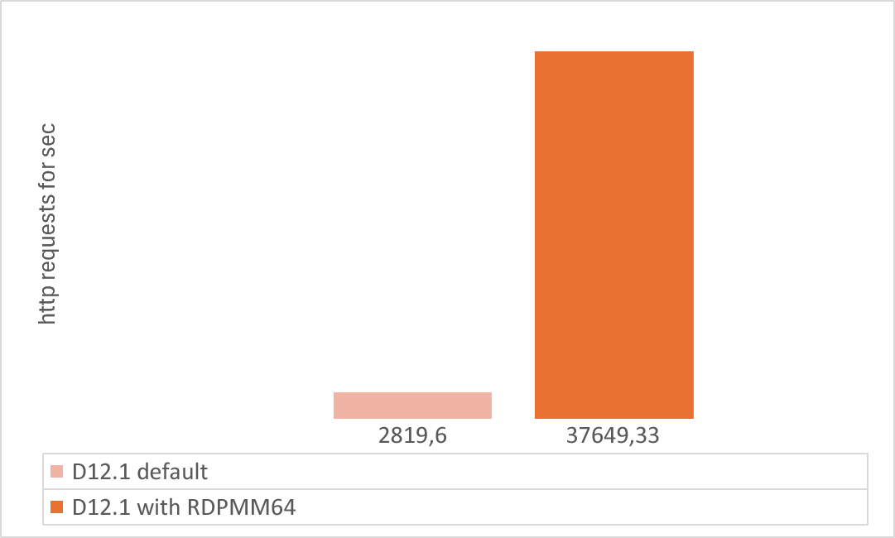

Sea RTL subset for Delphi 64bit

Object Pascal wrappers from Intel Integrated Performance Primitives and Intel Threading Building Blocks royalty-free packages

17 June 2019 Roberto Della Pasqua www.dellapasqua.com 
24 August 2022 DLL built with the latest stable Intel oneAPI and TBB ver. 2021.6 
10 January 2023 updated zlib to 1.2.13 with latest Intel IPP ver. 2021.7 
20 February 2023 updated webbroker deflate helper for reliability 
02 November 2023 updated oneTBB allocator (oneTBB src.v2021.12.0 msvc_19.29_cxx_64_md_release) 
8 August 2024 updated to Intel IPP v2021.13, zlib v1.3.1, visual c++ v19.29.30154

This folder contains:

- SeaMM.dll (md5 70f6767ffabf3a68c3886c04ce012d39 size 106496)
- SeaRTL.dll simd enabled rtl subset routines (md5 6f35648fbf2b386e3129ec82bb12d30d size 200704)
- SeaZIP.dll accelerated zlib compression (md5 5c4409f5c93f490119134bb5477a89fb size 982016)
- RDPMM64.pas wrapper for memory manager (put this unit as first unit clause in project source)
- RDPSimd64.pas wrapper for simd rtl
- RDPZlib64.pas wrapper for zlib deflate (level -2 AC mode in deflate call should be used over UTF-8 strings for web optimization, if you need to compress binary contents use level from 1 to 9 to avoid exceptions) 
- RDPWebBroker64.pas utils to enhance webbroker web apps  
- SeaIISFilter ultra-fast realtime deflate filter for IIS web server (5x faster than default gzip)(will update it with a small project built over this extension?)
- License.txt for legal terms
 

A common Delphi mvc rest library tested with apachebench and 100 concurrents users (vm windows 2022 intel 9900k) 
I bet we can obtain the highest position on techempower! 
 
About zlib IPP accelerated: 
You can use symbolic name Z_IPP_FAST_COMPRESSION, which is equal to -2:
    
Introduced new sub-ranges of compression levels from 11 to 29

The standard levels 1..9 are compatible with original Zlib

Levels 11..19 are similar to 1..9, but fit better when compressing large files (more than 1 MB)

Levels 21..29 are for highly compressible files with compression ratio equal to 30x and higher.
  
If you want enable accelerated zlib programmatically into your WebBroker app, just add one line of code in afterdispatch event:

- procedure TWebModule.WebModuleAfterDispatch(Sender: TObject; Request: TWebRequest; Response: TWebResponse; var Handled: Boolean); 
- begin 
- Response.ZlibDeflate;
- end;

The library is well tested, run on Intel and Amd x64 Windows, if you found any trouble please notify me; 
big thanks to the Delphi community and its great coders, in particular for the support received from Bruno Fierens (TMS), Daniele Teti (Bittime) and many others. 

Contact me: roberto dot dellapasqua at live.com

Thank you and best regards

Roberto Della Pasqua
